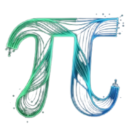

# WeView



<h3 align="center">WiFi-based Spatial Intelligence Platform</h3>

<p align="center">
  <strong>Real-time human pose estimation, 3D Observatory, and CSI sensing visualization using MediaPipe, WebGL, and Rust.</strong>
</p>

---

## Overview

**WeView** is a next-generation sensory and spatial intelligence platform that transforms ordinary WiFi signals (Channel State Information - CSI) into actionable spatial data. By fusing low-cost RF hardware (like ESP32) with advanced computer vision (MediaPipe) and web-based 3D visualization, WeView allows you to detect, track, and render human poses—even through walls or in the dark.

This repository primarily contains the **Frontend UI & Visualization Dashboards** designed to be deployed instantly on Vercel.

## Live Demonstrations

The WeView UI includes four primary interactive modules:

### 1. Observatory 3D
A fully interactive 3D environment rendering human body meshes using WebGL and Three.js. 
- **Features:** Realistic, DensePose, and X-Ray rendering modes.
- **Tech Stack:** WebGL, Three.js, WebSockets.

### 2. Pose Fusion
Dual-modal computer vision demonstration that fuses live optical tracking with WiFi CSI data.
- **Features:** Utilizes the "Honesty Filter" to suppress hallucinated lower-body keypoints when only the upper body is visible.
- **Tech Stack:** MediaPipe, WebAssembly (WASM), Canvas API.

### 3. Observatory 2D
A classic top-down floor plan visualization for high-performance occupancy heatmaps and tracking paths.
- **Features:** Lightweight spatial telemetry rendering.
- **Tech Stack:** Vanilla JS, Rust Backend (WebSocket hooks).

### 4. NVSim Magnetometer
Vite + Lit dashboard for the NV-diamond magnetometer simulator.
- **Features:** Dual-modal camera pose fusion telemetry.
- **Tech Stack:** Vite, Lit, TypeScript.

## Deployment (Vercel)

This frontend can be easily deployed to Vercel as a static site.

1. Fork or clone this repository.
2. Go to your [Vercel Dashboard](https://vercel.com/new).
3. Import the repository.
4. **Important Configuration:** Set the **Root Directory** to `ui/`.
5. Click **Deploy**.

## Local Development

To run the UI locally without a server backend:

```bash
cd ui
python3 -m http.server 3000
```
Then open `http://localhost:3000` in your browser.

*(Note: Certain features like Live CSI WebSocket streaming require the WeView Rust Backend and ESP32 Firmware to be running locally).*

## How it Works

1. **RF Sensing:** ESP32 nodes capture WiFi Channel State Information (CSI) as radio waves bounce around a room.
2. **Signal Processing:** A local Rust server cleanses the signal and extracts features.
3. **Fusion Engine:** The frontend (this repository) fuses the RF data with optical camera data (MediaPipe) to create a highly accurate, honest skeletal representation of humans in the room.

## License

This project is licensed under the MIT License. Built for Economic Survival 2026.
